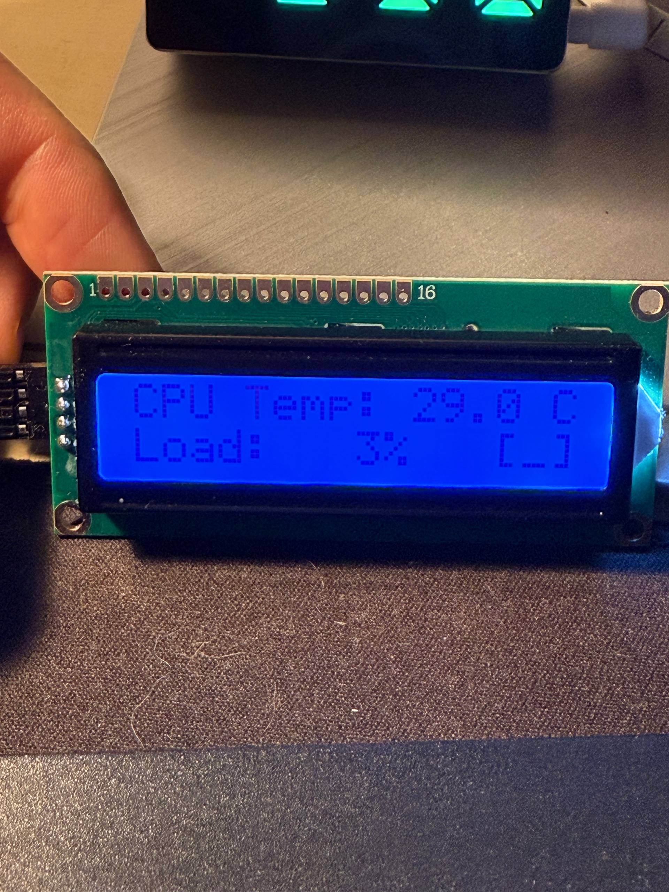

# Arduino CPU Monitor

Real-time CPU temperature and load monitoring on LCD display via Arduino Pro Micro.



## Features

- 🌡️ Real-time CPU temperature monitoring
- 📊 CPU load percentage display
- 🔌 Auto-reconnect on USB disconnect
- 🚀 Automatic startup with system
- 🔍 Auto-detection of Arduino port

## Hardware Requirements

- Arduino Pro Micro (or compatible ATmega32U4 board)
- LCD 1602 I2C Display (16x2 characters)
- 4 jumper wires
- USB cable

## Wiring

| LCD I2C | Arduino Pro Micro |
|---------|------------------|
| VCC     | VCC (5V)        |
| GND     | GND             |
| SDA     | Pin 2           |
| SCL     | Pin 3           |


## Installation

### Step 1: Clone the Repository

```bash
git clone https://github.com/yourusername/arduino-cpu-monitor.git
cd arduino-cpu-monitor
```

### Step 2: Arduino Setup

1. **Open Arduino IDE**
2. **Install Required Library**
   - Go to Tools → Manage Libraries
   - Search for `LiquidCrystal I2C`
   - Install the one by Marco Schwartz or Frank de Brabander

3. **Configure Board**
   - Tools → Board → Arduino Leonardo (or SparkFun Pro Micro)
   - Tools → Port → /dev/ttyACM0 (or your port)

4. **Upload Sketch**
   - Open `arduino/cpu_monitor/cpu_monitor.ino`
   - Click Upload (→) or press Ctrl+U

### Step 3: Python Setup

#### Option A: System Package Manager (Recommended)

```bash
# Install dependencies
sudo apt install python3-serial python3-psutil

# Add user to dialout group for USB access
sudo usermod -a -G dialout $USER

# Log out and back in for changes to take effect
```

#### Option B: Using pip

```bash
# Install dependencies
pip3 install -r requirements.txt

# Add user to dialout group for USB access
sudo usermod -a -G dialout $USER

# Log out and back in for changes to take effect
```

### Step 4: Test Run

```bash
# Make script executable
chmod +x python/cpu_monitor.py

# Run the monitor
python3 python/cpu_monitor.py
```

## Usage

### Run Manually

```bash
python3 python/cpu_monitor.py
```

### Install as System Service (Optional)

For automatic startup with system:

```bash
# Copy service file
sudo cp systemd/cpu-lcd-monitor.service /etc/systemd/system/

# Reload systemd
sudo systemctl daemon-reload

# Enable service to start at boot
sudo systemctl enable cpu-lcd-monitor

# Start service now
sudo systemctl start cpu-lcd-monitor

# Check service status
sudo systemctl status cpu-lcd-monitor
```

### Load Indicators

The display shows CPU load using these indicators:

- `[_]` = 0-25% (Idle)
- `[=]` = 25-50% (Normal)
- `[#]` = 50-75% (Busy)
- `[!]` = 75-100% (High)

## Display Format

```
CPU: XX.X°C
[indicator] XX%
```

Example:
```
CPU: 45.2°C
[=] 38%
```

## Troubleshooting

### Arduino Not Detected

- Check USB connection
- Verify correct port permissions: `ls -l /dev/ttyACM*`
- Ensure user is in dialout group: `groups $USER`

### Display Not Working

- Check I2C connections
- Verify I2C address using: `i2cdetect -y 1` (on Raspberry Pi)
- Default address is usually 0x27 or 0x3F

### Python Script Errors

- Ensure all dependencies are installed
- Check Python version: `python3 --version` (3.6+ required)
- Verify serial port access rights

## Project Structure

```
arduino-cpu-monitor/
├── arduino/
│   └── cpu_monitor/
│       └── cpu_monitor.ino    # Arduino sketch
├── python/
│   └── cpu_monitor.py         # Python monitoring script
├── systemd/
│   └── cpu-lcd-monitor.service # Systemd service file
├── docs/
│   └── images/
│       ├── result.jpg         # Project photo
│       └── wiring.png         # Wiring diagram
├── requirements.txt           # Python dependencies
└── README.md                  # This file
```

## License

MIT License - See [LICENSE](LICENSE) file for details

## Contributing

Pull requests are welcome! For major changes, please open an issue first to discuss what you would like to change.

## Acknowledgments

- LiquidCrystal I2C library by Marco Schwartz
- psutil library for system monitoring
- Arduino community for extensive documentation

## Author

Maksim Iakunin - [@miakunin](https://github.com/miakunin)

## Links

- [Project Repository](https://github.com/miakunin/arduino-cpu-monitor)
- [Issues](https://github.com/miakunin/arduino-cpu-monitor/issues)
- [Arduino IDE Download](https://www.arduino.cc/en/software)
